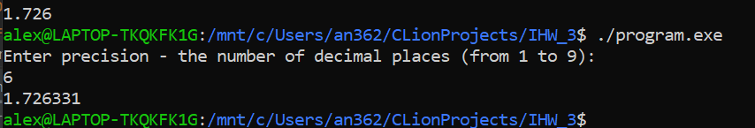

# Архитектуры вычислительных систем. ИДЗ № 3. Вариант 33 <br/> Нарин Алексей БПИ217.

# Описание репозитория:
* [Решение задачи на C](https://github.com/alexnurin/ACS_IHW_3/tree/main/C_files)
* [Папка с неоптимизированными файлами ассемблера](https://github.com/alexnurin/ACS_IHW_3/tree/main/ASM_wo_optimisations)
* [Оптимизированный код ассемблера](https://github.com/alexnurin/ACS_IHW_3/tree/main/ASM_optimized)
* [Тесты](https://github.com/alexnurin/ACS_IHW_3/tree/main/Tests)

# Отчёт о выполненных задачах (работал на оценку 7)
* 👍 Задача решена на языке C
* 👍 Ассемблерное решение прокомментировано (связь памяти и переменных С, передача и приём значений при вызове функций, использование регистров)
* 👍 Ассемблерный код вручную модифицирован и оптимизирован (подробнее ниже)
* 👍 Решение задачи состоит из двух единиц компиляции - файлы main и functions.
* 👍 Доступны три способа ввода: вручную, через файлы и через аргументы командной строки
* 👍 Реализовано тестовое покрытие

## Использование программы:
Входные данные - точность в виде натурального числа от 1 до 9 - количество знаков после запятой
Выходные - решение уравнения x^3 - 0.5 * x^2 + 0.2 * x - 4 = 0 в диапазоне [1;3] с заданной точностью.

1. Если вы хотите ввести точность вручную - запускайте программу без аргументов. 
```
/program.exe
```



2. Если вы хотите использовать ввод из файлов, вам следует передать названия файлов как аргументы командной строки:
```
/program.exe input.txt answer.txt
```
  У программы должны быть соответсвующие права на чтение и запись/создание файлов, иначе будет отображено сообщение об ошибке.

  Файлы следует поместить в одну папку с исполняемым файлом, либо на один уровень выше.

3. Если же вы хотите протестировать ввод строк с помощью параметров командной строки, вводите точность сразу туда.
```
./program.exe 4
```


# Отчёт о выполненных модификациях.

*(Во обоих файлах main.s, functions.s)*

### Удалены макросы:
``` assembly
cdqe
endbr64
```

### Удалены строки с мета информацией, не влияющие на выполнение программы.
``` assembly
.size	combination, .-combination
	.ident	"GCC: (Ubuntu 9.3.0-10ubuntu2) 9.3.0"
	.section	.note.GNU-stack,"",@progbits
	.section	.note.gnu.property,"a"
	.align 8
	.long	 1f - 0f
	.long	 4f - 1f
	.long	 5
0:
	.string	 "GNU"
1:
	.align 8
	.long	 0xc0000002
	.long	 3f - 2f
2:
	.long	 0x3
3:
	.align 8
4:

```
### Оптимизация регистров
Вручную заменил часто используемые переменные, перенеся их со стека на регистры.
В файле combination таким образом перенёс i со стека в r12d, а j - со стека в r13d
Помимо этого, оптимизировал ситуации, где rax выступал в роли ненужного посредника для данных, которые требовалось снять со стека чтобы к примеру передать аргументом через rdi. Пример на картинках
``` assembly
замена следующего вида:
	lea	rax, -128[rbp]
	mov	rdi, rax
превращается в
	lea	rdi, -128[rbp]
```
Также удалено лишнее зануление массива - в данной реализации за инициализацией следует присваивание значений а не обращение, поэтому занулённость избыточна.
``` assembly    
        mov	QWORD PTR -120[rbp], 0
	...
	mov	QWORD PTR -56[rbp], 0
```

Оптимизирован алгоритм вычисления функции: теперь xmm0 не вызывается как посредник для каждого переноса значений со стека,
а хранит результат функции. <br/>

```assembly
function:
	endbr64
	push	rbp
	mov	rbp, rsp
	movsd	QWORD PTR -8[rbp], xmm0
	movsd	xmm0, QWORD PTR -8[rbp]
	mulsd	xmm0, xmm0
	movapd	xmm1, xmm0
	mulsd	xmm1, QWORD PTR -8[rbp]
	movsd	xmm0, QWORD PTR -8[rbp]
	movapd	xmm2, xmm0
	mulsd	xmm2, xmm0
	movsd	xmm0, QWORD PTR .LC0[rip]
	mulsd	xmm0, xmm2
	subsd	xmm1, xmm0
	movsd	xmm2, QWORD PTR -8[rbp]
	movsd	xmm0, QWORD PTR .LC1[rip]
	mulsd	xmm0, xmm2
	addsd	xmm0, xmm1
	movsd	xmm1, QWORD PTR .LC2[rip]
	subsd	xmm0, xmm1
	pop	rbp
	ret
```
<br/>Стало:<rb/>
``` assembly
function:                               # xmm0 = x
	push	rbp
	mov	rbp, rsp
	movapd	xmm1, xmm0
	mulsd	xmm1, xmm1                  # xmm1 := x^2
    movapd	xmm2, xmm1                  # xmm2 := x^2
	mulsd	xmm2, xmm0                  # xmm2 = x^3
	movsd	xmm3, QWORD PTR .LC0[rip]   # xmm3 := 0.5
	mulsd	xmm3, xmm1                  # xmm3 = x^2 * 0.5
	subsd	xmm2, xmm3                  # xmm2 = x^3 - x^2 * 0.5
	movsd	xmm3, QWORD PTR .LC1[rip]   # xmm3 := 0.2
	mulsd	xmm3, xmm0                  # xmm3 = x * 0.2
	addsd	xmm2, xmm3                  # xmm2 = x^3 - x^2 * 0.5 + x * 0.2
	movsd	xmm1, QWORD PTR .LC2[rip]   # xmm1 := 4
	movapd  xmm0, xmm2
	subsd	xmm0, xmm1                  # xmm0 = x^3 - x^2 * 0.5 + x * 0.2 - 4
	pop	rbp                             # f(x)
	ret
```

В результате оптимизаций помимо уменьшения использования стека, сократилась количество строк кода. Это можно увидеть на сравнении [изначальных файлов ассемблера](https://github.com/alexnurin/ACS_IHW_2/tree/master/ASM%20not%20optimized) и [оптимизированных](https://github.com/alexnurin/ACS_IHW_2/tree/master/ASM_for_7):
* main.s
  241 -> 209
* functions.s
  147 -> 144
### Суммарное число строк уменьшилось на 35.


